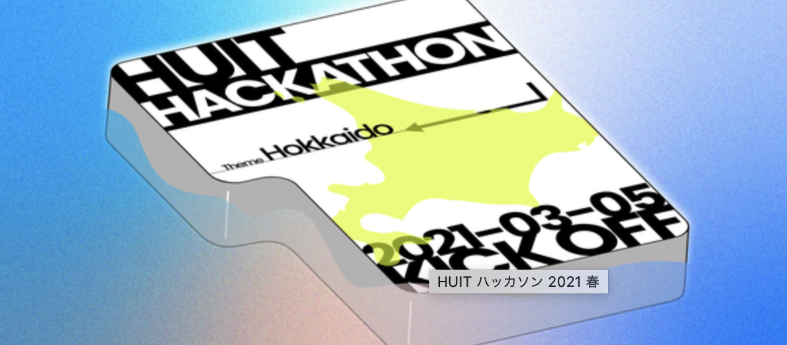

# 自己紹介資料

## 北海道大学工学部 4 年

## 茂木貴紀

---

# 茂木貴紀

- 所属: 北海道大学工学部情報エレクトロニクス学科 4 年(2024 年卒業予定)
- 北大 IT 研究会 HUIT の運営
- 未完 Project（社団法人化している北海道 IT コミュニティ）運営
- サウナ
  - The sauna（長野）
- 料理
- カメラ Olympus Pen

---

# 技術スタック

- TypeScript 2 年
  - Next.js / Express / Nuxt.js
  - Webpack
- Firebase 1 年以上
  - セキュリティルール / functions
- Go 半年
- Solidity (スマートコンストラクトを実装する言語) 2 ヶ月
- 一応 Python / C++ なども

---

# インターンシップで経験したこと

- webpack のバージョンを 1 から 5 にあげた
  - バンドラーの理解が少しできた
- JS + class Component を TS + function Component に切り替えた
  - React の歴史について少し理解できた
- GraphQL に入門した
  - Restful との違い（GraphQL めっちゃいいということ）がわかった

---

- liff を 1 から調査 -> 導入までやった
  - 1 から調査して実装するまでの体力がかなりついた
- テストをいっぱい書いた
  - DI を意識するコード（unit テストしやすいコード）がどんなものか理解できた
  - フロントのテストは結局難しくて理解できていない

---

# 他に経験してきたこと

- ハッカソンの主催（代表）
- 新入生歓迎会の主催（代表）
- 勉強会の講師

**北海道の IT を盛り上げていきたい思い**

- （技術系ではないが）イベントを多数主催
- 司会をいっぱい経験しました

---

# エンジニアとしての理想像・キャリア

- 自分自身で課題を見つけて 1 からプロダクトやライブラリなどを作れる状態になりたい
  - エンジニアが快適な作業を行えるようなもの
  - より直接的なアプローチ
- 上記を見据えた上での柔軟な思考を常に持ち続けたい
  - エンジニアにこだわる必要もない

---

# 現状の課題

- そのために今後どういう風にしていけばいいかわからない
  - もっと明確なものを持っていたほうがいいのだろうか？
  - （技術的な部分というよりは、思考の仕方や考え方において）どの部分をどう変化させていくことが大事なのか知りたい
- どういうベクトルで成長すればいいのか、優先度がわからない
  - 興味がある技術（ブロックチェーン、自然言語処理など）と成長しなければいけない部分（将来に関すること、軸など）のバランスを上手くとりたい

---

# 企業選びの軸

- まだ定まりきれていません、、
- 社員さんが社畜な会社で働きたい（仕事に対して夢中になっている、やめられない、という熱量のある環境）
- 技術的な観点だと、より大きなプロダクトを触ってみたい
- 課題や UX を考える機会があるなら、より小さなプロダクトを触ってみたい

世の中の大多数の人に影響を与えたい、というよりは、よりニッチな分野で自分のスキルがどう活かせるか、より良い状態を作れるか、ということに興味があります。
