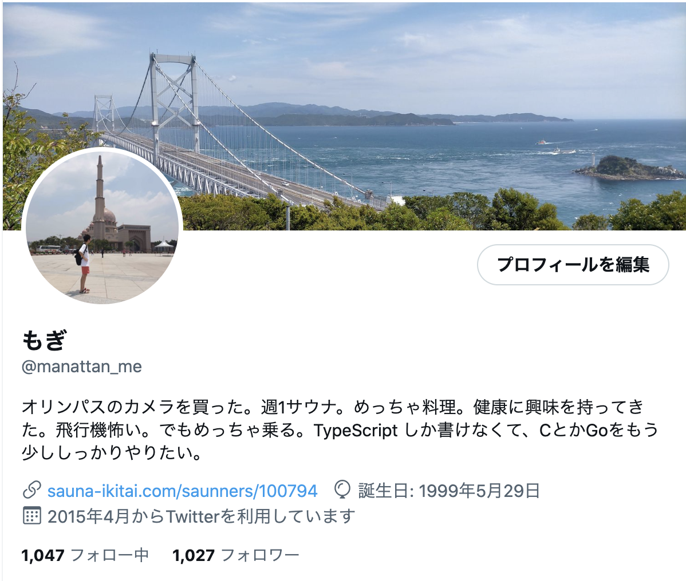

# サマーインターン参加記録をします

## 北海道大学工学部 ? 年

## もぎ たかのり

---

# 自己紹介

- 北大 IT 研究会 HUIT の運営をしていた気がします
- 未完 社団法人化している北海道 IT コミュニティ）運営 もちょっとやっていた気がします
- サウナによくいきます
- 料理をよくします
- 旅が好きやんな
- 神奈川県にいます
- twitter フォローしてください

---

# 休学が 2 年目に突入しました

- 去年
  - スタートアップに１年間生きつつ日本を放浪していました
- 今年
  - 現在は神奈川県に家がありまし
  - 長期アルバイトをしています
    - スタートアップ
    - one career
    - Pixiv
- 来年
  - 学部 4 年生をオンラインで行い、卒業予定でございます

---

# 自分の技術スタック的なところで言うと、

- TypeScript 2 年 ぐらい
- Go をまあまあ
- Ruby を少し

---

# 今日お話しすること

-　サマーインターンで学んだことを紹介したいと思います

---

# 参加したインターンシップ

- Retty 3weeks
- Cookpad 3weeks
- DMM 2weeks

---

# Retty 株式会社

- 詳しくはこちらを
  - https://engineer.retty.me/entry/2022/08/09/110000
- Go でマイクロサービスを開発しました
- TDD を体験しました
- クリーンアーキテクチャ完全に理解しました

---

## 所感

- 全部モブプロだったので、正直しんどかった感は否めませんが、めちゃめちゃ成長できて god だね！
- 会社がそこまで大きくないので、いろんなエンジニアといろんなお話ができて、good だね！
- サービス自体はそこまで複雑なものではないので、サービス観点で技術的に面白いことがあるかはその人しだいな気がしました。

---

# Cookpad 様

- 3 weeks
  - 1 week は授業
    - IOS 開発 SwiftUI
    - サービス開発入門
      - 課題を聞いて、MVP を作ってみる工程。コードは書かず、figma で作りました。
    - サーバーサイド開発
      - graphql の bff を Ruby で作りました。
  - 2week 開発
    - cookpad live cafe の予約管理画面の開発をしました
      - https://cookpadlive.cafe/collabo21

---

## 所感

- エンジニアのレベル高すぎて森
- なんでみんな Ruby ばっかできる人集まるん。。？w
- オフィスは wework でめっちゃいいよ

---

# DMM さま

- 2week の guild インターンです
- 課題をクリアしていくやつ

---

## 自分でやったこと

- 多くの monorepo で使われているパッケージの共通化
- Go のテストの追加
-
