<!--
_class: top
-->

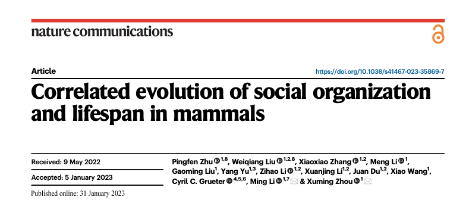

# 哺乳類における、社会組織と寿命の相関進化について

2023.06.20
Hokkaido Univ.
Takanori Mogi

---

<!--
_class: main
-->

# Abstract

- 集団生活している種は、単独生活している種よりも長生きする傾向にある
- 短命な状態から長命な状態への進化は、集団生活する種の方が高い
  - 社会性の進化と長寿の相関性が明らかになった
- 社会性と長寿の関連に関与する 31 の遺伝子、ホルモン、免疫を特定した
  - 社会性が長寿に及ぼす影響が分子レベルで認められた

<!-- まずこの論文の概要についてです。この論文では、哺乳類における社会組織形態と寿命の関連性について、一般化線形混合モデルを利用しつつ統計的な傾向を明らかにします。そして、その根拠を分子レベルで明らかにします。

結果として、集団生活している種は単独生活している種よりも長生きする傾向にあること、短命な状態から長命な状態への進化は、集団生活する種の方が高いこと、社会性と長寿に関連する遺伝子を特定することができました。 -->

---

<!--
_class: main
-->

# Introduction

- 哺乳類は単独生活(solitary living)、ペア生活(pair-living)、集団生活(group-living)など幅広い形態をとって生活する（Kappeler et al. 2002）
- 多くの社会性がある（多層社会、真社会性、半社会性）
- 寿命は 2 年（リュウグウノツカイ）から 200 年（ホッキョククジラ）まで幅広い
- 社会性の進化と寿命の関係性を明らかにすることは、動物の生活史がどのように進化してきたかを深く理解することができる

<!-- では、研究の背景についてです。哺乳類は生活形態が幅広く、大きくまとめると、単独生活、ペア生活、集団生活に分けることができます。また、それぞれについて多層社会や真社会性など多くの社会形態も存在します。寿命についても２年から200年と幅広いです。これらの関連性について明らかにすることは、動物の生活史がどのように進化してきたかを深く理解することにつながります。 -->

---

<!--
_class: main
-->

## Previous Research

- 単一種での研究はなされているが、種を越えたものは少ない。（真社会性に限定した研究など）

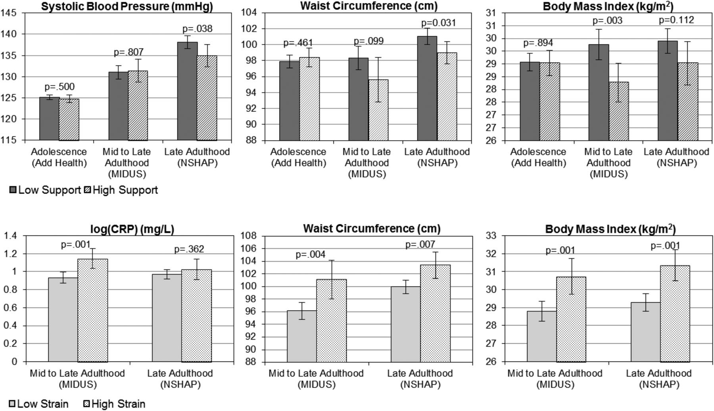

Yang, Y. C. et al.  2016

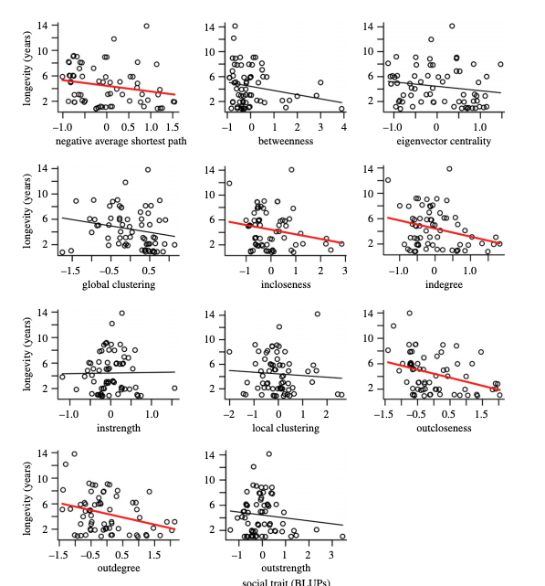

Archie, E. A. et al.  2018

<!-- 過去には単一種や社会性のの1例に限って研究した事例は存在するものの、それぞれの広い関連性などについて研究されている事例は少ないです。

例えば、集団生活を営む種に広く存在する繋がりは、死亡率を低下させ、健康や生存の成果を高めることによって、種の寿命が伸びる事が明らかになっています。逆に、イエローベルドマーモットの雌は、所属関係と寿命の間に負の相関関係があるkとが知られています。

したがって、長寿と多種の社会性の関連が哺乳類の系統に共通するかなどは依然として不明です。 -->

---

<!--
_class: main
-->

- 分子メカニズムの解明は完全にはなされていないが、いくつか可能性のある説が示唆されている。
  - ストレス緩衝仮説... 社会的な結びつきが有害な環境の刺激やストレスを軽減し、健康増進をさせる（Vila et al. 2021）
  - 感染症... 集団生活をしている種は、個体間の結びつきが強いので感染症にかかりやすい傾向にあるが、病原体から身を守るために免疫を進化させている可能性もある（Altizer, et al. 2003）
  - 生活ペース... 生活史が遅く（発育が遅い、繁殖力が低い）、寿命が長い種で社会的結合が強い可能性がある（Silk M.J et al. 2021）

<!-- また、分子レベルだと、いくつかの可能性が示唆されています。ただ、これらの相関性と分子メカニズムは、まだ理解が始まったばかりです。 -->

---

<!--
_class: main
-->

# Research / Methods

1. ベイズ推定を用いて、社会形態と長寿の異なる哺乳類約 1000 種の比較を行った。
   1. 単独生活(solitary living)、ペア生活(pair-living)、集団生活(group-living) を比較
2. 生活史や系統関係を踏まえた上で、哺乳類 94 種の脳内トランスクリプトーム解析を行った。
   1. 社会形態と長寿に関連する候補遺伝子、パスウェイを特定した。

<!-- そこで、この論文では、ベイズ統計を用いて哺乳類約1000種の社会組織と長寿の間の、各々の進化推測モデルの比較を行いました。さらに、哺乳類94種類の脳内トランスクリプトーム比較解析を行い、生活因子や系統関係をコントロールした上で、社会組織と長寿に関連する候補遺伝子とパスウェイを検出しました。パスウェイというのは、代謝経路やシグナル伝達形などの、遺伝子やタンパク質の相互作用の経路の種類のことを指します。 -->

---

<!--

_class: main
-->

## 系統分類図

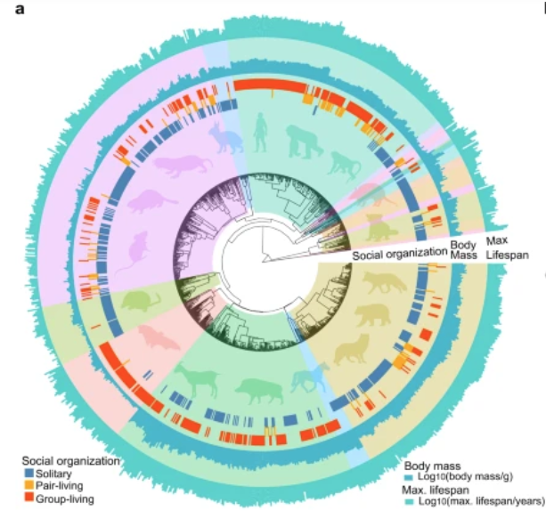

- 系統樹（中心）
- 社会組織の所属（真ん中の層）
- 成体量（外から 2 番目）
- 寿命（1 番外側）

<!--

  研究のデータには、複数のデータベースから成体量、最大寿命、社会組織、活動、ライフスタイル、化石性などのデータセットを解析に利用しました。

  まず。哺乳類974種について、社会組織の分類を行いました。単独生活、ペア生活、集団生活に分類され、内50種類が複数の状態絵思っています。

  社会組織、成体量、寿命の系統的分布。陰影の色は哺乳類の目の違いを示している。

   -->

---

<!--
_class: main
-->

## 組織の状態における寿命の違い

- 方法: 種の最大寿命（絶対寿命、左）と、絶対寿命に成体の体格を加味した相対的寿命（右）を寿命として社会組織に対して相関があるかどうかの分散分析を行った。

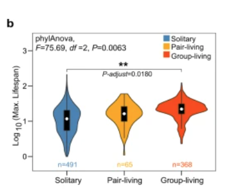

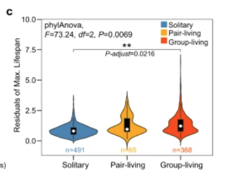

<!-- 系統的分散分析を行った。集団生活種は、単独種よりも長寿を示した。 -->

---

<!--
_class: main
-->

# 社会的組織と寿命との相関をさらに分析する

## 社会的組織の進化確率遷移モデルを形成

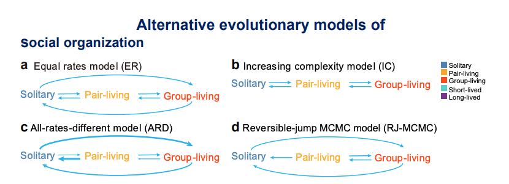

<!-- 次に、哺乳類の社会組織の3つの状態をつなぐ進化的経路を特定するために、各々の状態の移行率を異なるように変化させる事ができる4つのモデルを作成しました。

左上: 全ての遷移率が同じであるモデル ER
右上: 孤独生活とペア生活、ペア生活と集団生活の繊維は認めるが、孤独生活と集団生活の遷移は認められないモデル IC
左下: 全ての遷移率が異なるモデル ARD
右下: reversible-jump MCMC と呼ばれる、最も事後支持率が高いモデル RJ-MCMC -->

---

<!--
_class: main
-->

## 結果

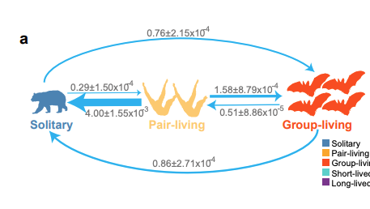

- "ペア生活 → 単独生活" > "単独生活 → ペア生活"

<!-- モデル比較の結果、ARDモデルが最も支持率の高いモデルだった。例えば、ペア生活から孤独生活への遷移率は、孤独からペア生活への14倍であり、かつ集団生活への遷移率も高いことから、ペア生活自体が比較的不安定である事が示唆されています。 -->

---

<!--
_class: main
-->

## 寿命に特化した遷移確率モデルの作成と、結果

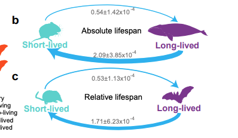

<!-- 次に、寿命の状態に関する3つのモデルを作成して、長寿と短寿においての進化経路について調べた。長寿命状態から短寿命状態への遷移率は、短寿命から長寿命への遷移率の約4倍である事がわかった。 -->

---

<!--
_class: main
-->

## 長寿命状態への遷移が、社会組織によってどう変化するか

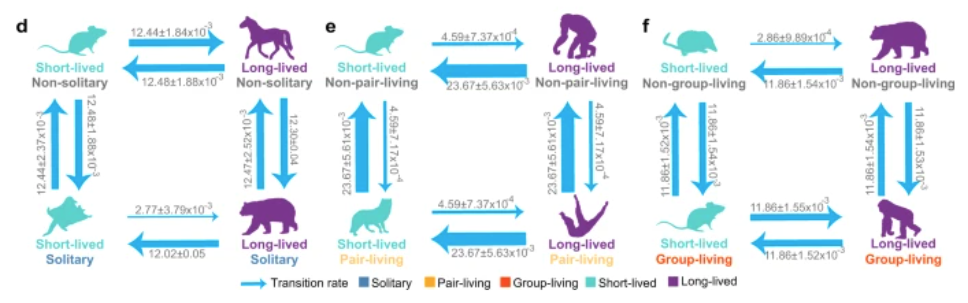

<!-- 短命から長命への遷移は、単独行動種よりも非単独行動種の方が高く、非集団行動種よりも集団行動種の方が高かった。すなわち、集団生活する種は長寿になりやすいという予想と一致している。

次に、集団行動種への遷移を調べると、双方向で同じだったので、長寿であることが集団生活の形成を促進をするわけではないことがわかった。

これらは、絶対寿命だけではなく、相対寿命でも結果が支持されました。 -->

---

<!--
_class: main
-->

## 社会組織の進化による長寿への相関を支える遺伝子を同定する

- 94 種の脳内トランスクリプトーム解析を実施

  - オルソログ遺伝子の同定
    - ヒトの CDS 配列と各々の転写物とでアライメントを実施
    - いい結果を示した遺伝子をオルソログと同定
  - オルソログの遺伝子発現量が、社会形態とどのように関連しているかの調査

  <!-- - ヒトの遺伝子配列とそれぞれのサンプルを比較したBLAST
  - 内64種で共通となっているオルソログ遺伝子を解析
  - 13402個のオルソログの発現量を全てのサンプルで測定 -->

<!-- - なぜ脳なのか
  - 脳は社会行動や社会システムを仲介する中枢機関で、脳内トランスクリプトームは長寿形質に関連する遺伝子やパスウェイを同定するために使用されている

- 方法
  - gffreadというツールを用いて、ヒトのCDS配列（タンパク質翻訳領域）を抽出し、各遺伝子について最も長い転写物を抽出した
  - 上記を他の種でも抽出し、それぞれでBLASTを行なった
  - ベストヒットを持つ遺伝子をオルソログと特定
  -  -->

---

<!--
_class: main
-->

## 形態ごとに発現が多い遺伝子、少ない遺伝子があることがわかった

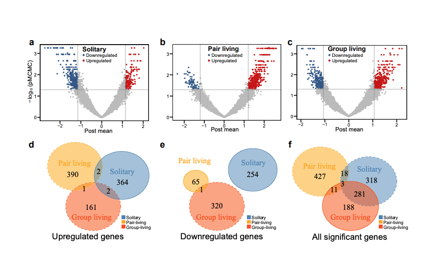

<!-- 社会形態によって分類した種に対して、発現量が多い遺伝子、少ない遺伝子がある事がわかった -->

---

<!--
_class: main
-->

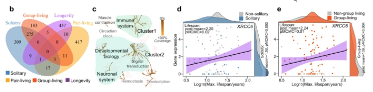

- 長寿に関連する遺伝子 31 つを同定
- その中でのクラスターが見られた
  - 寿命と社会的組織に関与していると考えられる遺伝子を同定（右 2 つ）

<!-- 発現レベルが、社会組織と長寿の両方に有意に関連する31の遺伝子を発見しました。これに対してReactome platform を用いて pathway topology解析を行ったところ、2つの強いクラスターが見つかった。

1つ目のクラスターには免疫関連遺伝子が含まれていた。例えば、ZFP36遺伝子はT細胞の活性化を制御することにより、ウイルス免疫を調節し、TNF-αなどの炎症性サイトカインを制御することにより炎症性疾患から保護するもののコード化に関与している。

また、右の2つのグラフは、そのクラスターに含まれているXRCC6と呼ばれる遺伝子なのですが、これはp70自己抗原のサブユニットをコードする遺伝子で、最近の研究でこの遺伝子のスプライシングバリアントが自閉症を引き起こす可能性が示されました。また、この遺伝子のノックアウトはマウスの寿命を縮め、この遺伝子の高発現がヒトの平均寿命の延長につながっていることから、この遺伝子は寿命と社会的組織の両方に関与している可能性が高いことが考察されます。

右のグラフでは、寿命と発現量に正の相関がわかり、かつ、孤独な種では発現量が低く、集団生活する種では発現が上昇していることがわかるかと思います。

2番目のクラスターには、ホルモン、神経系、シグナル伝達の制御に関連する遺伝子で構成されていた。これらの遺伝子の中には、社会的行動への関与が示唆されているものがあり、例えば、KALRN遺伝子はシナプス結合、認知、学習、社会行動に必須なカリリンの交互スプライシング形態をいくつか作り出し、この遺伝子をマウスでノックアウトするとワーキングメモリの欠損、運動量の方、社会的行動の減少が起こることが知られていおります。 -->

---

<!--
_class: main
-->

## さらに、4 つの 一般化線形混合効果モデルを定義した

- 孤独生活関連の遺伝子を同定するためのモデルで、全ての種を孤独か非孤独に分類
- ペア生活関連の遺伝子を同定するためのモデルで、全ての種をペアか非ペアに分類
- 集団生活関連の遺伝子を同定するためのモデルで、全ての種を集団か非集団に分類
- 集団生活関連の遺伝子を同定するためのモデルで、全ての種を単独生活、ペア生活、集団生活に分類
<!--
これは、社会組織と長寿に関連する遺伝子発現の全体像を把握するためで、異常の遺伝子ではなく、相関を示すパスウェイを特定します。各パスウェイ の遺伝子の事後平均の合計を算出し、比較しました。
 -->

---

<!--
_class: main
-->

## 社会性と寿命に相関のあるパスウェイ

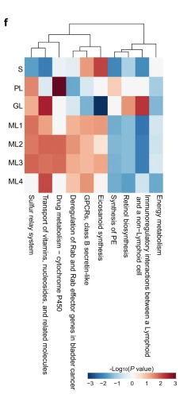

- 計 10 の、社会組織と寿命に相関のあるパスウェイを発見
- immunoregulatory interactions between a lymphoid and a non-lymphoid cell という経路
  - 長寿との負の相関を示した。
  - 単独行動する種では発現が低下するが、集団生活する種では発源が上昇した。
  - 感染症のリスクの上昇に対する免疫応答？

<!-- その上で、polisel法と呼ばれる、統計学アプローチを用いてそれぞれのモデルの相関を特定しました。

リンパ球と非リンパ球の間の免疫制御相互作用

それぞれの社会組織と有意な相関をしめしてパスウェイは50つ前後見つかったが、社会組織と長寿に累積的な相関を示したのは上記10つだった。

これらを通して、社会組織と長寿の関連性の根底にあるホルモンと免疫のプロセスを特定できた
 -->

---

<!--
_class: main
-->

## オルソログ遺伝子の選択係数の推定

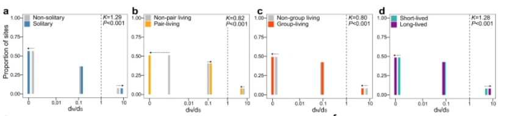

- 自然選択にどう影響されているかを調査した

<!-- 次に、社会組織や寿命の長さが自然選択にどう影響されているかはまだわからないため、RELAXというソフトウェアを用いて、社会組織と寿命が異なる状態の中でのオルソログ遺伝子の選択係数の比較と、自然選択の強さを調査しました。一番左の孤独状態では、選択係数が1を超え、それは自然選択がより強まっており、突然変異の固定確率が高い一方で、集団状態での選択係数は1より低い値になっていて、正の自然選択が緩やかになってきていることを示します。

さらに、長寿のために自然選択が強まっている遺伝子の数は集団生活種より孤独生活種の方が多く、長寿状態では孤独生活種より集団生活種でより自然選択が緩やかになっています。これらのことから集団生活する長生き状態には、自然選択が緩まることが関与していることが示唆させています。 -->

---

<!--
_class: main
-->

## polysel を用いた、パスウェイ解析

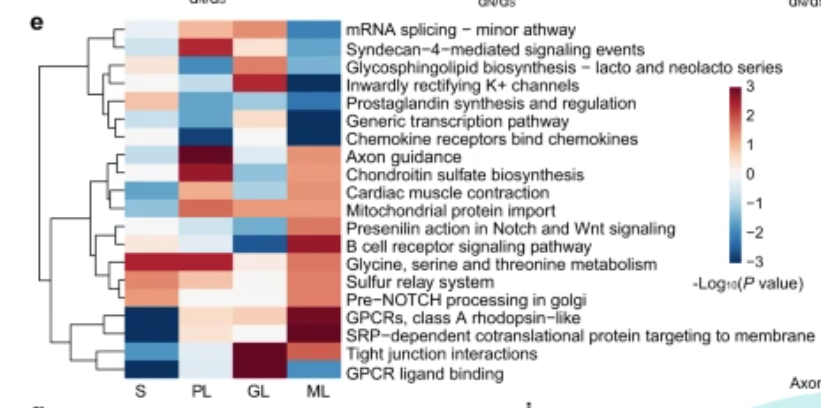

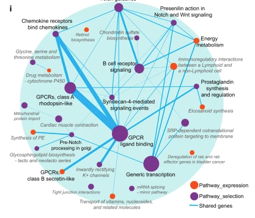

- 自然選択が有意に変動するパスウェイを抽出した
- 自然選択に同一の傾向を示さなかった

<!-- 次に、各遺伝子の選択係数を踏まえて、polysel法と呼ばれる手法を用いてパスウェイ解析と有意に自然選択が強化されたものと緩和されたものを特定しました。この図は長寿な個体と社会組織の両方で自然選択が有意に変動する遺伝子を抽出したものですが、社会組織について同一の傾向を示していません。

例えば、B細胞受容体シグナル伝達経路は、集団生活種では緩やかな自然選択が起こっていたが、長寿な種では自然選択が強まりました。また、別の経路では、集団生活種にて自然選択度合いが上昇したが、長寿種では選択度合いが緩和されました。

このことにより、長寿と社会組織について、自然選択によって共通のパスウェイが利用されることがあっても、その根底にある分子メカニズムや制御アプローチは異なることを示しています。

右の図は社会組織と長寿の両方における発現と選択の相関を示すネットワークになっていて、円の大きさはそのパスウェイに含まれる遺伝子の数、接続線の太さは2つのパスウェイ間で共有される遺伝子の数を示しています。

 -->

---

<!--
_class: main
-->

# Conclusion

- 社会組織と寿命の相関的な進化の根拠を示すことができ、集団生活する種が単独生活する種よりも長生きであることを示した。
- 免疫経路、炎症経路およびその遺伝子は、社会性と長寿の相関に関連している
- 孤独な種は社会性が低いと仮定していたが、哺乳類の社会は個体構成や育児パターン、集団など多様な形態をとるので、あくまでも相関進化研究の基礎となるものである
